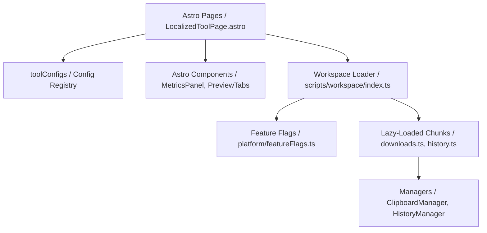

# Platform Architecture & Dependency Graph

This document details the dependencies and runtime relationships between layouts, registry configurations, components, and module managers.

---

## 1. Dependency Diagram

---

## 2. Interaction Flows

1. **Static Stage (Build-Time)**:
   * `[slug].astro` reads settings from `toolConfigs` matching page parameters.
   * Astro compiles layout HTML static nodes.
   
2. **Bootstrap Stage (Load-Time)**:
   * `tool-workspace.ts` launches `createWorkspace(slug)`.
   * Feature flags check active properties.
   * On-demand chunks are fetched asynchronously.
   
3. **Execution Stage (Interaction-Time)**:
   * Typing triggers case converters, metrics calculation, and updates DOM previews.
   * Clicks invoke clipboard writes and cache copy history logs in localStorage.
