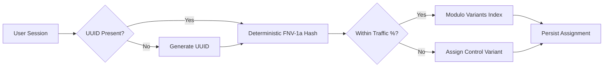

# A/B Testing Framework Technical Documentation

This document describes the technical architecture and specifications of the native, serverless A/B Testing framework built for TapToGen.

---

## 1. Core Architecture

The framework is built to operate client-side to maintain 100% compatibility with static pages generated by Astro, without introducing server-side redirect latency or middleware requirements.

### Bucketing Architecture Diagram


---

## 2. API Specifications

### `getVariant(experimentId: string): string`
Returns the assigned variant (`'control'`, `'variant_b'`, etc.) for the current user.
- **Deterministic**: Variant assignments are stable and will not flip for the same user.
- **Persisted**: Saved in `localStorage` to guard against changes in traffic allocations or configuration.

### `triggerExposure(experimentId: string): string`
Resolves the variant and dispatches exposure events to Vercel Analytics and Google Analytics 4.
- Event Name: `experiment_exposure`
- Parameters: `experiment_id`, `variant_id`

### `forceVariant(experimentId: string, variant: string): void`
Manually forces a user to a specific variant (primarily for QA and visual testing).

---

## 3. QA Overrides & Debugging

### URL Override Parameters
To force a specific variant during QA, append `ab_[experiment_id]=[variant_name]` to the query string:
```
https://taptogen.com/tools/fancy-text-generator/?ab_cta_button_text_experiment=create_now
```

### Sandbox Debug Panel
In development, the framework includes a debug panel that lets developers switch variants on the fly.
To enable:
```javascript
import { injectDebugPanel } from '@/lib/ab-testing';
injectDebugPanel();
```
