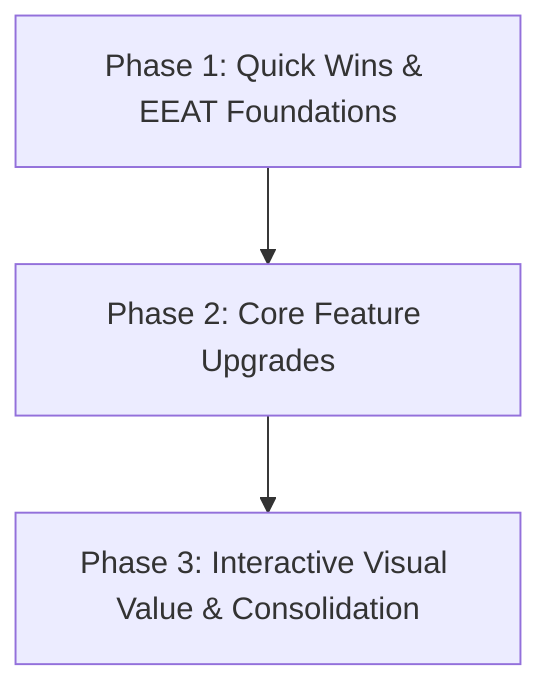

# Product Development Roadmap

This roadmap outlines prioritized release phases to systematically improve the TapToGencom generator ecosystem, focusing on user retention, SEO authority, and feature completeness.

---

## Release Phases Overview

---

## Phase 1: Quick Wins & EEAT Foundations (Short-term)
Focuses on low-effort, high-SEO ROI improvements, specifically trust signals and structural elements.

| ID | Improvement Feature | Target Niche | Est. Effort | Est. ROI | Priority |
| --- | --- | --- | --- | --- | --- |
| RM-101 | **Expert Author Bios & Review Badges** | All (especially Legal/Science YMYL pages) | Low | High | **High** |
| RM-102 | **Live Generation Counter & Usage Stats** | All tools | Low | Medium | **High** |
| RM-103 | **PDF Document Exporting** | Business, Legal, and Proposal generators | Medium | High | **High** |
| RM-104 | **Interactive Star Ratings** | All landing pages | Low | Medium | **Medium** |

---

## Phase 2: Core Feature Upgrades (Medium-term)
Focuses on upgrading input controls, output quality, and configuration options.

| ID | Improvement Feature | Target Niche | Est. Effort | Est. ROI | Priority |
| --- | --- | --- | --- | --- | --- |
| RM-201 | **Slider Inputs for Numeric Fields** | Math, CSS, and styling options | Low | Medium | **Medium** |
| RM-202 | **Context-Aware Prompt Builders** | ChatGPT & DALL-E prompts | Medium | High | **High** |
| RM-203 | **Live Preview Cards & Style Theme Selectors** | CSS and color palette generators | Medium | High | **High** |
| RM-204 | **Bulk Generation Options** | Name and keyword generators | Medium | Medium | **Medium** |

---

## Phase 3: Interactive Visual Value & Consolidation (Long-term)
Focuses on major architectural enhancements, interactive design tools, and page consolidation.

| ID | Improvement Feature | Target Niche | Est. Effort | Est. ROI | Priority |
| --- | --- | --- | --- | --- | --- |
| RM-301 | **Unified Fonts & Aesthetic Text Editor** | All text-styling and font tools (Consolidation) | High | Very High | **High** |
| RM-302 | **Canvas-Based Interactive Design Editor** | Poster, Flyer, and Business Card generators | High | Very High | **Critical** |
| RM-303 | **Interactive Map Layer SVGs** | Fantasy Map generator | High | High | **Medium** |
| RM-304 | **Interactive Spinning Wheel Canvas** | Name Wheel, Pick a Name generators | Medium | High | **High** |
